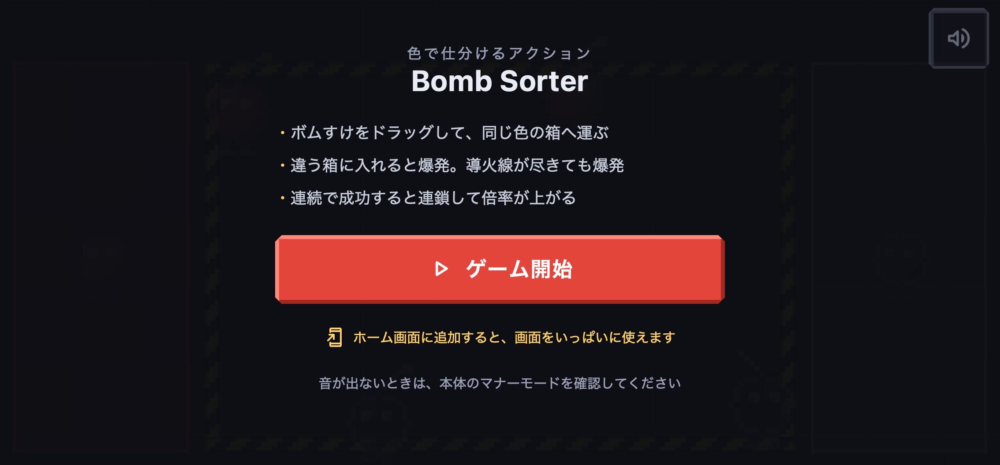
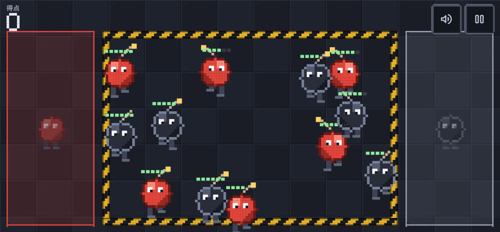
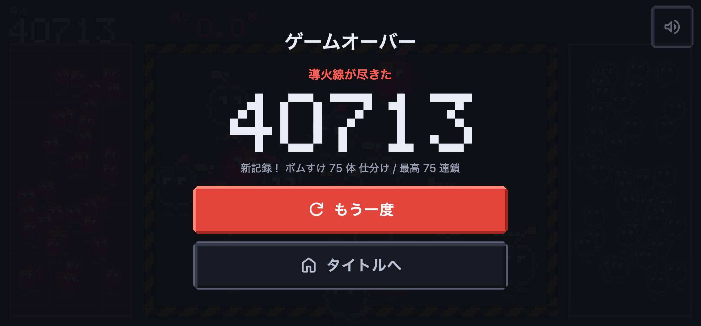

# Bomb Sorter

歩き回る「ボムすけ」を色で仕分ける、**横持ち**のスマホ向けタッチアクションゲームです。

**遊ぶ → https://kanade0525.github.io/bomb-sorter/**

<p>
  
  
  
</p>

## 遊び方

**端末を横向きにして遊びます。** 縦のままだと案内が出ます。
画面右上の全画面ボタンでブラウザの UI を隠せます（iPhone の Safari は要素の全画面表示に
対応していないので、その場合はホーム画面に追加すると画面をいっぱいに使えます）。

- 鉄板の床の上を、ボムすけが自分の足でよちよち歩き回っています
- **開始した瞬間から 12 体がうじゃうじゃ出てきます**。落ち着いて 1 体ずつ運ぶ時間はありません
- 指でドラッグして、**同じ色の箱**へ運びます（左が赤、右が黒）
- 違う色の箱に入れると爆発してゲームオーバー
- 導火線が尽きても爆発。頭の上のドットが残り時間です
- 続けて成功すると連鎖して倍率が上がります。最後の成功から 3 秒以内に次を決めると継続
- 時間が経つほど、出てくる間隔が短く・同時に出る数が多く・導火線が短くなります

仕分けたボムすけは箱の中に残って歩き回ります。どれだけ捌いたかが数字ではなく目で分かります。
指は 2 本まで同時に使えるので、両手の親指で左右へ振り分けられます。

## 作りの方針

このゲームは「ニンテンドー DS の、赤と黒の爆弾をタッチペンで仕分けるミニゲームが面白かった」
という記憶から出発していますが、**遊び方（仕組み）だけを参考にした完全オリジナル**です。
特定の作品のキャラクター・名称・意匠は一切使っておらず、任天堂株式会社とは何の関係もありません。
キャラクターは「ボムすけ」という自作のピクセルアートで、床の鉄板もトラロープもコードで描いています。

素材を一切同梱していないのも意図的です。

- **絵**: Canvas 2D に 1 ドットずつ手続き的に描いています。画像ファイルは 1 枚もありません
  （PWA のアイコンも `npm run icons` がコードから描き出したものです）
- **数字**: ウェブフォントを読み込めないので、得点や連鎖数の字形は 5x7 のドットで
  [コードに持っています](src/view/pixel-font.ts)。日本語のラベルだけはシステムフォントです
  （漢字を 5x7 で組むと読めなくなるため）
- **音**: 効果音も BGM も Web Audio API でその場で合成しています。音源ファイルは 1 つもありません
- **文字**: OS 標準のフォント（`system-ui`）だけを使い、ウェブフォントを読み込みません
- **アイコン**: Material Symbols のパスデータを SVG としてインラインで埋め込んでいます（詳細は [NOTICE.md](NOTICE.md)）

結果として、このページは**起動後に外部へ 1 バイトも通信しません**。
それを願いではなく不変条件にするため、本番ビルドには CSP を差し込んで `connect-src 'none'` を宣言しています。
スコアはブラウザの localStorage にだけ保存され、サーバへ送られることはありません。

## 開発

```bash
npm ci
npm run dev        # http://localhost:5173/bomb-sorter/ を開く（/ ではないので注意）
```

`base` を `/bomb-sorter/` に固定しているので、開発サーバも本番と同じパス構造になります。
`import.meta.env.BASE_URL` が dev と本番で常に一致するため、Service Worker のスコープや
manifest の `start_url` がずれる類の事故が構造的に起きません。

### よく使うコマンド

| コマンド          | 内容                                                   |
| ----------------- | ------------------------------------------------------ |
| `npm run check`   | 書式・型・単体テスト・自作検査。push 前にこれを通す    |
| `npm run test`    | Vitest を監視モードで                                  |
| `npm run build`   | 型チェック込みでビルド                                 |
| `npm run preview` | ビルド結果を http://localhost:4173/bomb-sorter/ で配信 |
| `npm run e2e`     | Playwright を iPhone / Android / デスクトップの 3 種で |
| `npm run shots`   | 目視確認用のスクリーンショットを `shots/` に出す       |
| `npm run icons`   | PWA アイコンと favicon をコードから描き直す            |
| `npm run verify`  | check → build → e2e を一気に                           |

### URL で挙動を変えられるもの（検分用）

| パラメータ          | 意味                                                                                                                                     |
| ------------------- | ---------------------------------------------------------------------------------------------------------------------------------------- |
| `?seed=12345`       | 乱数の種を固定する。同じ種なら同じ展開になる                                                                                             |
| `?frozen=1`         | rAF を止めてフレーム手送りにする。E2E とスクリーンショットで使う                                                                         |
| `?insets=47,0,34,0` | safe-area（上,右,下,左）を差し込む。`env()` はブラウザの自動化から設定できないので、ノッチ端末のレイアウトを手元で見るために用意している |

### 実機で確かめる

```bash
npm run dev -- --host
# 表示された http://192.168.x.x:5173/bomb-sorter/ を同じ Wi-Fi のスマホで開く
```

WebKit のエミュレーションでは分からないもの（サイレントスイッチでの無音、
ホーム画面に追加したときの表示、実際のドラッグの感触）は実機でしか確認できません。

## 設計

```
src/
├── core/        型・定数・乱数・算術。どこにも依存しない
├── game/        ★ 純粋レイヤ。ゲームのルール全部。DOM も Date も Math.random も触らない
├── view/        Canvas 描画とレイアウト計算
├── input/       Pointer Events とキーボード
├── audio/       Web Audio による合成
├── platform/    localStorage / Service Worker / メディアクエリ
├── ui/          DOM のオーバーレイとアイコン
├── app/         固定タイムステップと rAF ループ
└── main.ts      唯一の結線点
```

要点は **`src/game/` を副作用ゼロの純関数群にしてある**ことです。乱数は `world.rng` を
引数で持ち回り、音や描画は呼ばずに `world.effects` へ「起きたこと」を積むだけにしています。
そのおかげでゲームのルール全体が Vitest だけで、描画なしに検証できます。
この境界が崩れていないかは `tools/check.mjs` が機械的に見張っています。

数値パラメータ（難易度カーブ、導火線の長さ、スコア式など）はすべて
[`src/core/constants.ts`](src/core/constants.ts) の 1 箇所に集めてあります。調整はそこだけで済みます。

### テストの三層

| 層   | 道具                                | 何を見るか                                                   |
| ---- | ----------------------------------- | ------------------------------------------------------------ |
| 単体 | Vitest（`src/**/*.test.ts`）        | スコア式・難易度カーブ・当たり判定・状態遷移・導火線・決定性 |
| E2E  | Playwright（`tests/e2e/*.spec.ts`） | 実際にドラッグしてゲームが動くか、PWA、読み上げ、レイアウト  |
| 目視 | Playwright（`tests/shots/`）        | 見た目・セーフエリア・文字の読みやすさ                       |

`tests/manual/` には、CI に載せない検分用のスクリプトを置いてあります
（極端な画面サイズの計測、300 秒の連続プレイ、フレームレート、HUD の文字幅の実測、
レターボックス時のボタン位置など）。`npm run e2e` は `tests/e2e` だけを見るので CI では走りません。
必要なときに `npx playwright test tests/manual/<名前>.spec.ts` で回します。

Canvas は DOM ノードを持たないので、E2E からは `window.__BOMB_SORTER__` 経由で
ゲームの内部状態を読み、`advance(ms)` でフレームを手送りしています。
rAF に任せると CI の負荷でタイミングがぶれて必ず不安定になるためです。
このフックは本番ビルドにも残しています（理由は
[`src/debug/testhook.ts`](src/debug/testhook.ts) のコメント）。

画像の差分比較（`toHaveScreenshot`）はあえて使っていません。Canvas のアニメーションと
フォント描画の差で CI が不安定になり、`--update-snapshots` を惰性で叩く運用に落ちるためです。
機械判定は数値で行い、スクリーンショットは人が見るためのものと割り切っています。

## 配慮していること

- **色で区別するが、明度でも判別できるようにする**: ボムすけは 2 種類とも完全に同じ姿で、
  違うのは色だけです。形での冗長化をやめた代わりに、赤 `#e4453a` と黒 `#2a2e3a` という
  **コントラスト比 5.3:1** の組み合わせを選んでいます。色の区別がつかなくても、
  グレースケールでも「明るい方／暗い方」で判別できます。この比率は
  [`palette.test.ts`](src/view/palette.test.ts) が機械的に見張っています。
  難易度上昇に色の見分けにくさは使いません（上げるのは同時数・間隔・導火線・歩く速さだけ）
- **動きを減らす設定**（`prefers-reduced-motion`）: 画面の揺れと閃光を止め、粒子を減らし、
  導火線の鼓動をやめて代わりに残量ゲージを太くします
- **読み上げ**: 操作は Canvas ではなく本物の `<button>` で作ってあります。
  スコアは 1 秒に 1 回だけ `aria-live` に流します（毎フレーム更新すると読み上げが破綻するため）
- **片手操作**: 仕分け先は親指の届く画面下部に、ミュートと一時停止は誤タップしにくい上部に。
  タップ領域は 44×44 CSS px 以上を確保しています
- **ホームインジケータ**: 画面最下部にドロップ先を置くとスワイプがアプリ切り替えに化けるので、
  `safe-area-inset-bottom` の分を必ず空けています
- **理不尽で死なせない**: ボムは落下せずフィールド内を漂うだけなので、触っていないボムが
  勝手にゾーンへ入ることがありません。判定は指を離した瞬間の位置だけで確定するので、
  ドラッグ中に境界をかすめても誤爆しません。通知や着信でドラッグが途切れてもミスになりません。
  タブから戻ったときは一時停止状態で、カウントダウンを挟んでから再開します。
  ツールバーの出入りで画面の高さが変わったときは、掴んでいた指を手放します
  （座標系が変わった瞬間に、指を動かしていないのに誤爆死する状態になっていたため）
- **正誤のヒントは出さない**: 箱の上にボムすけを持っていくと箱が光りますが、それは
  「どこに落ちるか」を示すだけで、色が合っているかは教えません。落とす前に正誤が分かると
  慌てて間違える瞬間が無くなり、パニックゲームでなくなるためです

## ライセンス

コードは MIT（[LICENSE](LICENSE)）。第三者の著作物については [NOTICE.md](NOTICE.md) を見てください。
